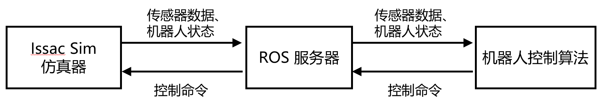

## Isaac Sim code
这是一个基于isaac sim 4.5 的用于模仿学习算法训练和测试的仿真框架，支持从数据采集到模型训练，和仿真环境部署的全流程。基于我们的配置系统，你要做的是编写合适的配置文件，指定各个参数。

<image src="media/dp_success.gif" height=500 width=1000>

## 直接安装
该repo的环境安装较为复杂，涉及isaac sim、ROS 以及模拟学习算法环境的安装，由于我们仅在ubuntu 20.04上测试了该环境，因此安装过程中可能会遇到很多的问题，希望及时反馈给我们。

### Step1: 安装系统级依赖包
```
    sudo apt-get update && apt-get install -y \
    wget \
    curl \
    git \
    unzip \
    lsb-release \
    sudo \
    gnupg \
    libgl1-mesa-glx \
    libglib2.0-0 \
    libx11-xcb1 \
    libxcb1 \
    libxcomposite1 \
    libxcursor1 \
    libxdamage1 \
    libxi6 \
    libxrandr2 \
    libxrender1 \
    libxtst6 \
    libnss3 \
    libatk1.0-0 \
    libatk-bridge2.0-0 \
    libgtk-3-0 \
    python3 \
    python3-pip \
    g++ \
    && sudo apt-get clean && rm -rf /var/lib/apt/lists/*
```
### Step2: 安装 Isaac Sim 4.5
建议参考 [Isaac Sim Document](https://docs.isaacsim.omniverse.nvidia.com/4.5.0/installation/download.htmlhttps://docs.isaacsim.omniverse.nvidia.com/4.5.0/installation/download.html)

(1) 下载 Isaac Sim 二进制安装包，并解压到 ~/isaac_sim
```
    cd ~
    mkdir isaac_sim
    wget https://download.isaacsim.omniverse.nvidia.com/isaac-sim-comp-check%404.5.0-rc.6%2Brelease.675.f1cca148.gl.linux-x86_64.release.zip
    unzip isaac-sim-standalone\@4.5.0-rc.36+release.19112.f59b3005.gl.linux-x86_64.release.zip -d ./isaac_sim
```
(2) 测试 Isaac Sim 能否正常运行
```
    cd isaac_sim
    ./isaac-sim.sh
```
如果一切顺利，你将打开 Isaac sim 的 GUI 界面，并显示一个空的场景

注意： 首次运行 Isaac Sim 时需要进行初始化操作，可能需要等待一段时间
### Step3: 安装 ROS1
由于代码中使用了 ROS1 进行 Isaac Sim 和模仿学习算法之间的通信，，因此需要安装 ROS

(1) 设置 ROS1 的软件源

使用一下命令添加 ROS1 的仓库
```
sudo sh -c 'echo "deb http://packages.ros.org/ros/ubuntu $(lsb_release -sc) main" > /etc/apt/sources.list.d/ros-latest.list'

```
添加 ROS1 的 GPG 密钥
```
sudo apt-key adv --keyserver 'hkp://keyserver.ubuntu.com:80' --recv-key C1CF6E31E6BADE8868B172B4F42ED6FBAB17C654
```
(2) 安装 ROS1 Noetic
```
    sudo apt  update
    sudo apt install ros-noetic-ros-base
``` 
(3) 将 ROS1 添加到环境变量
echo "source /opt/ros/noetic/setup.sh" >> ~/.bashrc
source ~/.bashrc

(4) 验证 ROS1 的安装
启动 ros 服务器，如果没报错则说明成功安装
```
    roscore
```

### Step4: 下载源代码和所需资源
**方式1: 直接从服务器上下载整合包**

路径位于 /data/tangpeiyuan/Isaac-Sim-code.zip

**方式2：从网络下载资源**

从 github 上克隆源代码：
```
    git clone https://github.com/tpy001/Isaac-Sim-code.git 
```
下载所需的素材和模型权重, 从谷歌网盘上下载对应的资源，然后解压存放到 Isaac-Sim-code 里的指定目录下

| 文件名 | 下载地址 | 存放路径 | 说明 | 
| ----|  ----|   ----| ----| 
| assets.zip | [下载链接](https://drive.google.com/file/d/1YO-QUmsUO1EL6-ufekpOuxfi8pEyNPSb/view) | assets/ | USD 场景描述文件，可导入 Isaac Sim 生成场景|
| policy_best.ckpt | [下载链接](https://drive.google.com/file/d/195WMK5dS404OvDBJuZ_8LmOHY6cbPX_0/view?usp=drive_link) | act/ckpt/stack_cube_simv3/ | act 用于 stack cube 的模型权重 |
| dataset_stats.pkl | [下载链接](https://drive.google.com/file/d/1Y4wgCPAUgqHqvmcaK4Qf04QZvR0amXHW/view?usp=drive_link) | act/ckpt/stack_cube_simv3/ | act 数据集相关参数
| stack_cube_simv3.ckpt/ | [下载链接](https://drive.google.com/file/d/1yts-3JZrXCnVMRMQQIN6ScpOfNXdr89i/view?usp=drive_link) | umi/ckpt | dp 用于 stack cube 的模型权重


### Step5: 安装 ACT 和 Diffusion Policy 环境
(1) 安装 ACT 环境
```
    
    cd Isaac-Sim-code/act
    conda create -n aloha python=3.8.10
    conda activate alpha
    pip install torch==2.1.0 torchvision==0.16.0 torchaudio==2.1.0 --index-url https://download.pytorch.org/whl/cu121
    pip install pyquaternion
    pip install pexpect
    pip install mujoco==2.3.7
    pip install dm_control==1.0.14
    pip install opencv-python-headless
    pip install matplotlib
    pip install einops
    pip install packaging
    pip install h5py
    pip install ipython
    pip install rospkg==1.6.0 pyparsing==2.4.6 pyyaml==5.3.1 empy==3.3.2
    cd detr/ && pip install -e . # 进入 act 根目录下的 detr/
```
(2) 安装 Diffusion Policy 环境
```
    cd Isaac-Sim-code/umi
    sudo apt install -y libosmesa6-dev libgl1-mesa-glx libglfw3 patchelf
    conda env create -f conda_environment.yaml
    conda activate umi
    pip install rospkg==1.6.0 pyparsing==2.4.6 pyyaml==5.3.1 empy==3.3.2
```

### Step6: 编译 ROS
为了让 isaac sim, act, diffusion policy 识别自定义的 ROS 消息的服务，需要把 ROS 编译到这三个环境里 (貌似只编译到 Isaac Sim 也行)
#### (1) 编译到 Isaac Sim
安装一些必要的包到 Isaac Sim 环境，假设 isaac sim 安装的根目录的路径为 <isaac_sim>
```
    cd Isaac-Sim-code # 进入到之前 clone的那个 Isaac-Sim-code 仓库
    <isaac_sim>/python.sh -m pip install ./requirements.txt # 请替换这里的 <isaac_sim> 为你的isaac sim 的根目录
```
编译 ROS 到 Isaac Sim
```
    cd Isaac-Sim-code 
    ./ros_msg_compile.sh <isaac_sim>/kit/python/bin/python3 # 请替换这里的 <isaac_sim> 为你的isaac sim 的根目录
```
如果编译成功，会显示：
```
Scanning dependencies of target act_dp_service_generate_messages
[100%] Built target act_dp_service_generate_messages
🎉 Build successful.
```
如果报错了，看一下是不是缺少 python 的包，使用下列命令安装包到 Isaac sim 环境：
```
<isaac_sim_path>/python.sh -m pip install <package_name>
```

#### (2) 检测是否编译成功
```
    cd Isaac-sim-code
    source ./catkin_ws/devel/setup.bash # 激活一下 ROS
    python  # 进入 python
    from act_dp_service.srv import get_action, get_actionResponse # 如果执行这条语句没显示 "No module named ..."，则代表前面的操作是成功的
```

### Step7: 运行 Stack Cube 任务

运行该任务需要启动三个终端，分别用于 Isaac Sim, ROS, ACT或DP 算法，整体的运行逻辑如下图所示：

(1) 运行 ROS
```
    roscore
```
(2) 运行用于 Stack Cube 的 Isaac Sim 仿真环境
修改 Isaac-Sim-code 目录下的 run.sh 文件的第一行
run.sh 内容
```
    isaac_sim_root=~/Desktop/isaac_sim #  替换为你的 Isaac Sim 的根目录
    ......
```
运行：
``` 
    cd Isaac-Sim-code
    ./run.sh stack_cube_act_v3
```

(3) 运行 ACT 或 DP 算法
运行 act：
```
    cd Isaac-Sim-code/act
    source ../catkin_ws/devel/setup.bash

    python3 server.py \
    --task_name stake_cube_scripted \
    --ckpt_dir ckpt/stack_cube_simv3 \
    --policy_class ACT --kl_weight 10 --chunk_size 20 --hidden_dim 512 --batch_size 8 --dim_feedforward 3200 \
    --num_epochs 2000  --lr 1e-5 \
    --seed 0 --eval --temporal_agg
```
运行成功的结果：
<video controls>
    <source src="media/act_success.mp4" type="video/mp4"> 
    Act 算法运行成功的结果
</video>
运行 dp:
```
    cd Isaac-Sim-code/umi
    source ../catkin_ws/devel/setup.bash
    python3 scripts_sim/inference_umi.py --ckpt_path ckpt/stack_cube_simv3.ckpt --n_action_steps 4
```
运行成功的结果：
<video controls>
    <source src="media/dp_success.mp4" type="video/mp4"> 
    Act 算法运行成功的结果
</video>
